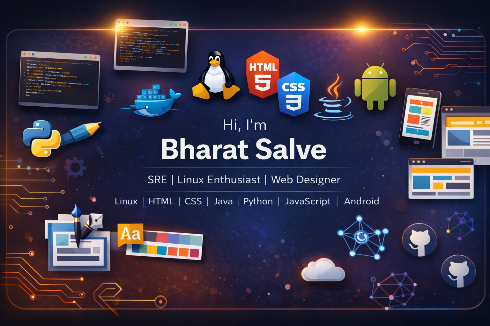

  

<h1 align="center">Hi 👋, I'm Bharat Salve</h1>

SRE Aspirant | Linux Enthusiast | Full-Stack Developer

I'm a Computer Science student focused on building reliable, scalable systems.  
From Linux and DevOps fundamentals to modern web development, I enjoy turning ideas into real-world projects.  
Currently sharpening my skills in SRE, automation, and backend engineering — aiming to build systems that are fast, stable, and production-ready.

